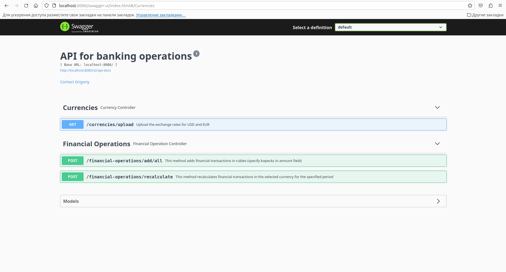
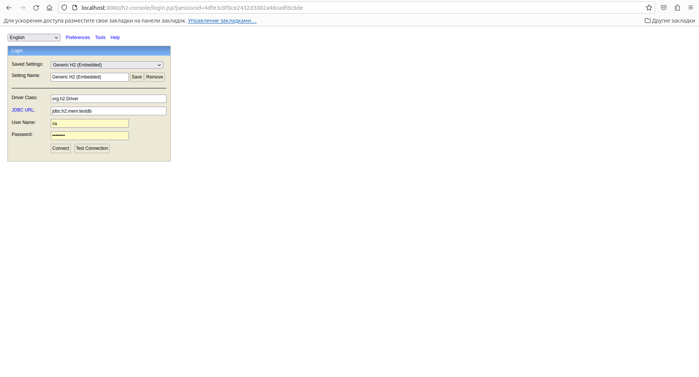
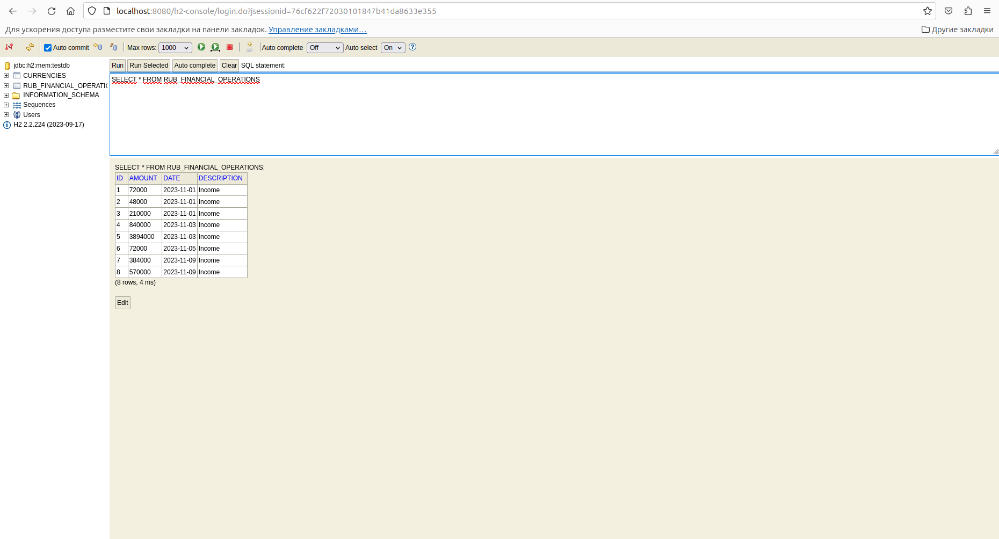
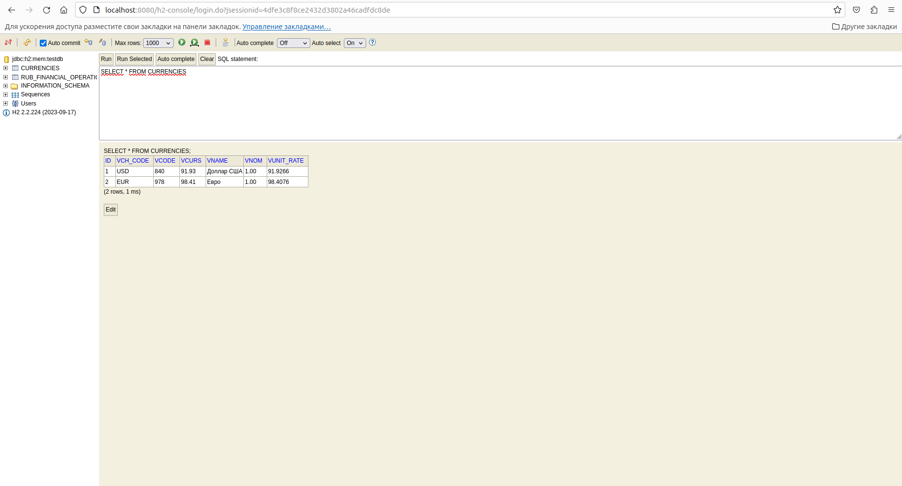

## About the application
1. The H2 database stores objects in memory. 
2. Upon each application shutdown the database with data is deleted.
3. Upon each application startup SQL containing objects is imported.
4. Currencies are automatically loaded twice a day at the specified time (9:00 and 21:00)
5. There are three methods:
* adds financial transactions in rubles (specify kopecks in amount field)
* uploads the exchange rates for USD and EUR
* recalculates financial transactions in the selected currency for the specified period

## Screenshots









## How to open Swagger-UI
```
http://localhost:8080/swagger-ui/index.html
```

## How to connect to the H2 database
```
Address:  http://localhost:8080/h2-console
Url:      jdbc:h2:mem:testdb
Username: sa
Password: password
```

## The application is developed using Java 17

## Frameworks
| Name                           | Version  |
|--------------------------------|----------|
| spring-boot-starter-parent     | 2.7.17   |
| spring-boot-starter-data-jpa   | 2.7.17   |
| spring-boot-starter-web        | 2.7.17   |
| spring-boot-starter-validation | 2.7.17   |
| spring-boot-starter-test       | 2.7.17   |

## Libraries
| Name                   | Version |
|------------------------|---------|
| springfox-boot-starter | 3.0.0   |
| h2                     | 2.2.224 |
| jackson-dataformat-xml | 2.13.0  |
| lombok                 | 1.18.30 |

## [How to test manually](testing.md)

## JUnit tests have been written

## Run Spring Boot application without tests
```
mvn spring-boot:run
```

## Run Spring Boot application with tests
```
mvn clean install spring-boot:run
```

## [Issues faced while completing the test task](problems.md)

## Contacts
| Name     | Phone + WhatsApp | Telegram           | Email                 |
|----------|------------------|--------------------|-----------------------|
| Grigoriy | 8-924-116-18-34  | posmitniy_grigoriy | pga.profile@gmail.com |
